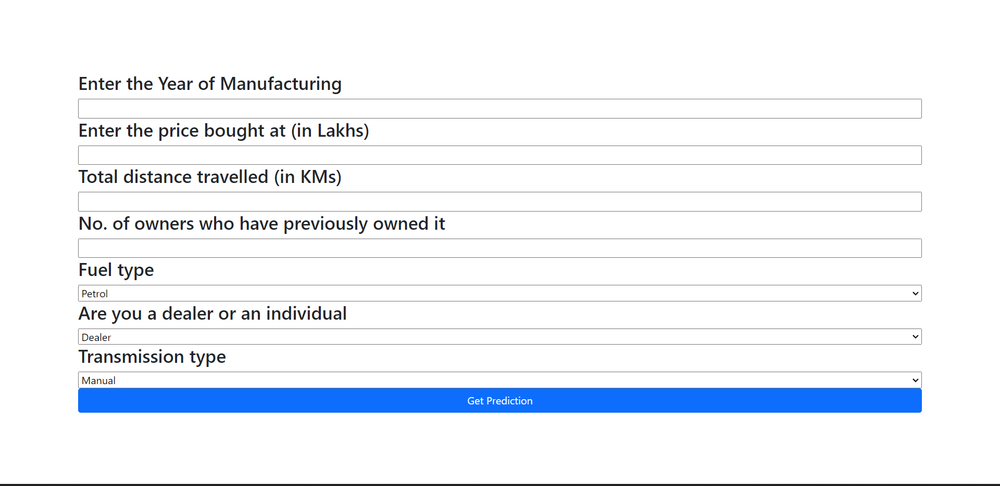
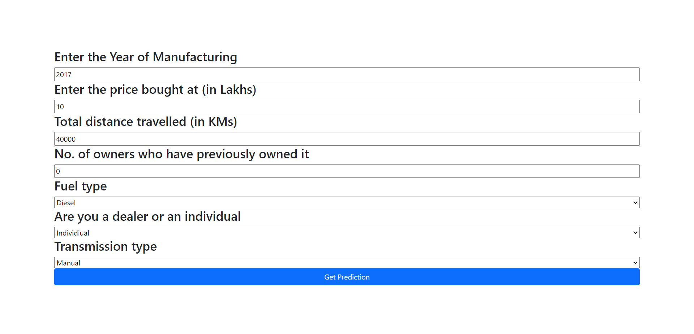
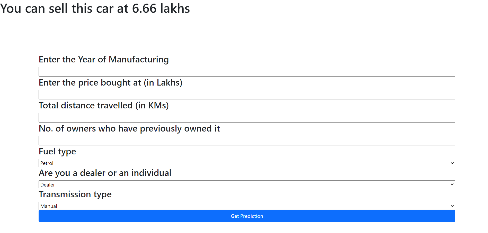

# Car Predictor

### Overview
This website uses a trained car predictor model to predcit the price of the car using Random Forest classifier
Stack Used
1. Flask
2. OpenCV
3. HTML/CSS

### Live Link
https://car-pr3dictor.herokuapp.com/

### Screenshots

#### Result

### Novelty
1. Simple and easy User Interface.
2. Result is displayed instantly.
3. Model is pre-trained so no need to wait.
